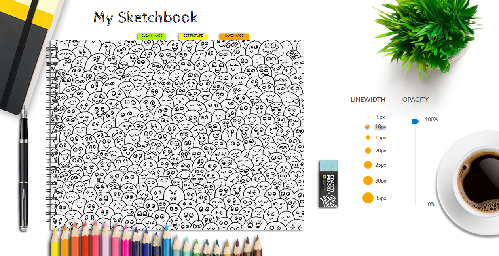

# :: My Sketchbook ::
 
Do you remember your first project? 
It's mine and - you know - I'm so proud!     ༼ つ ◕_◕ ༽つ  

A simple app made in HTML/Canvas, CSS and Javascript. 
Enjoy drawing, colorizing and sketching whatever you want.
You can get random picture for colorizing and save your work.
##

### [Live version](https://unpolaco.github.io/My-Sketchbook/)

## Technologies
* HTML5 / Canvas
* CSS3
* JavaScript